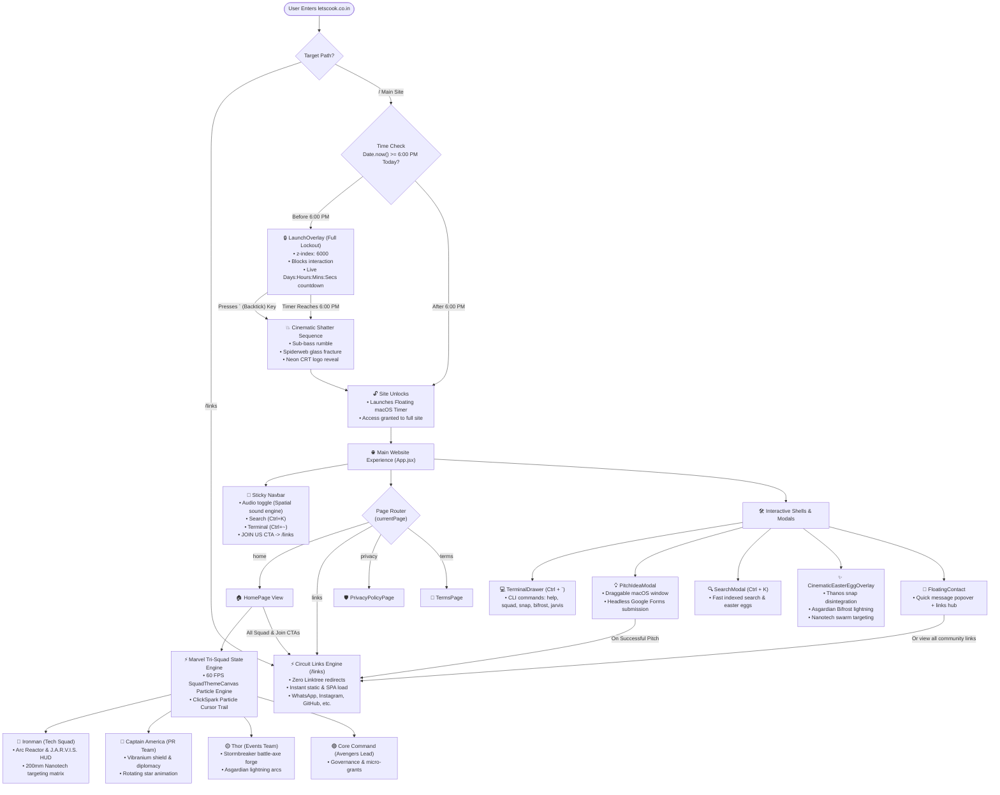

# Let's Cook Website — System Architecture & Workflow Diagram

Comprehensive visual and structural workflow documentation for **Let's Cook** ([letscook.co.in](https://letscook.co.in/)).

---

## 1. High-Level Flowchart (Mermaid)

---

## 2. Core Architecture Subsystems

### Phase 1: Ingress & Launch Lockout Gate
- **Target Condition**: Validates whether the current local time is before **6:00 PM today** (`18:00:00 IST`).
- **Files Involved**:
  - `src/App.jsx`
  - `src/components/LaunchOverlay.jsx`
  - `src/utils/countdown.js`
- **Behavior**:
  - If `Date.now() < 18:00:00`, `showLaunchOverlay` initializes to `true`.
  - The page displays a full-screen lockout overlay (`z-index: 6000`, `position: fixed; inset: 0`) blocking all underlying pointer events and scrolling.
  - A real-time countdown calculates remaining **Days : Hours : Minutes : Seconds**.
- **Access Bypass**:
  - **Pressing the `` ` `` (backtick / tilde / keyCode 192)** key triggers the cinematic shatter sequence (`playCinematicShatter()`).
  - Pressing `` ` `` a second time immediately skips the animation and unlocks access.
  - When the timer reaches `00:00:00`, the site automatically shatters and unlocks.
  - Upon unlocking, the movable floating macOS countdown window (`MacOsTimerWindow.jsx`) is activated.

---

### Phase 2: Page Routing & Community Links Engine
- **Files Involved**:
  - `src/App.jsx`
  - `src/pages/LinksPage.jsx`
  - `public/links/index.html` & `public/links.html`
  - `vercel.json`
- **Zero Third-Party Redirects**:
  - All occurrences of external `linktr.ee/letscookfoundry` have been permanently eliminated.
  - External traffic visiting `letscook.co.in/links` loads an ultra-fast, standalone static page in **<50ms** with complete OpenGraph cards.
  - In-app navigation uses `LinksPage.jsx` with native `popstate` browser Back/Forward support.
- **Official Links Hosted**:
  1. **Website**: [letscook.co.in](https://letscook.co.in/)
  2. **WhatsApp Community**: [chat.whatsapp.com/Gogg1uWXakiEPFmmtQrTHL](https://chat.whatsapp.com/Gogg1uWXakiEPFmmtQrTHL)
  3. **Instagram**: [@letscook_com](https://www.instagram.com/letscook_com/)
  4. **LinkedIn**: [Let’s Cook Community](https://www.linkedin.com/company/let-s-cook-community-the-foundry/)
  5. **GitHub**: [github.com/letscook-community](https://github.com/letscook-community)
  6. **Social Chips**: X, Threads, Facebook, Email (`foundry@letscook.co.in`).

---

### Phase 3: Marvel Tri-Squad State Engine
- **Files Involved**:
  - `src/components/HomePage.jsx`
  - `src/components/SquadThemeCanvas.jsx`
  - `src/components/ClickSpark.jsx`
- **Global Theme Class**: `theme-ironman` | `theme-captain` | `theme-thor` | `theme-core`
- **Squad Profiles**:
  - **Iron Man (Tech Squad)**: Arc Reactor insignia, J.A.R.V.I.S. HUD optics, 200mm nanotech particle matrix simulation (`#ff0055` & `#00f0ff`).
  - **Captain America (PR Team)**: Vibranium Shield insignia with rotating star animation and vibranium ping audio (`#0055ff` & `#38bdf8`).
  - **Thor (Events Team)**: Movie-accurate Stormbreaker battle-axe SVG with lightning arcs and thunder strike audio (`#d97706` & `#f59e0b`).
  - **Foundry Command (Core Team)**: Avengers initiative crest coordinating community governance and micro-grants (`#8b002e` & `#f59e0b`).

---

### Phase 4: Developer Shell, Overlays & VFX
- **Files Involved**:
  - `src/components/TerminalDrawer.jsx`
  - `src/components/PitchIdeaModal.jsx`
  - `src/components/SearchModal.jsx`
  - `src/components/CinematicEasterEggOverlay.jsx`
  - `src/components/FloatingContact.jsx`
- **Interactive Triggers**:
  - **Terminal Drawer**: `Ctrl + ~` or `Cmd + ~` opens a bottom dock shell supporting commands: `help`, `squad`, `snap`, `bifrost`, `jarvis`, `pitch`, `clear`.
  - **Search Modal**: `Ctrl + K` or Navbar Search icon opens quick search across initiatives, FAQs, links, and founder credits.
  - **Pitch Modal**: Draggable macOS window for project submissions via headless Google Forms.
  - **Cinematic Easter Eggs**: Full-screen VFX overlays including Thanos snap disintegration, Asgardian Bifrost lightning, and Stark nanotech target matrix.
